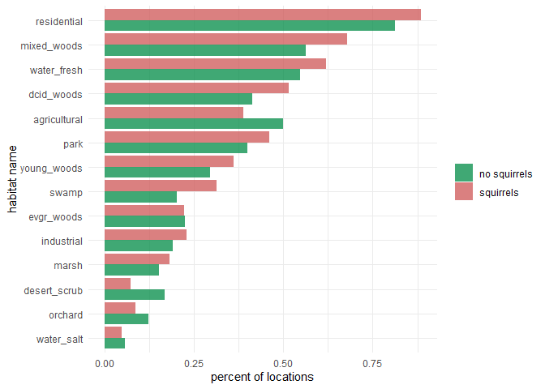
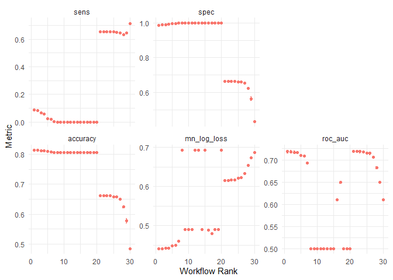

handling class imbalance in bird feeder observations
================
chad allison
2023-01-20

### setup

``` r
library(tidyverse) # essential functions
library(tidymodels) # essential for modeling
library(themis) # downsampling
library(vip) # variable importance
theme_set(theme_minimal())
```

### importing data

``` r
link = "https://raw.githubusercontent.com/rfordatascience/tidytuesday/master/data/2023/2023-01-10/PFW_count_site_data_public_2021.csv"

site_data = read_csv(link, col_types = cols()) |>
  mutate(squirrels = ifelse(squirrels == 1, "squirrels", "no squirrels"))

glimpse(site_data)
```

    ## Rows: 254,355
    ## Columns: 62
    ## $ loc_id                       <chr> "L100016", "L100016", "L100016", "L100016~
    ## $ proj_period_id               <chr> "PFW_2002", "PFW_2003", "PFW_2004", "PFW_~
    ## $ yard_type_pavement           <dbl> 0, 0, 0, 0, 0, 0, 0, 0, 0, 0, 0, 0, 0, 0,~
    ## $ yard_type_garden             <dbl> 0, 0, 0, 0, 0, 0, 0, 0, 0, 0, 0, 0, 0, 0,~
    ## $ yard_type_landsca            <dbl> 1, 1, 1, 1, 1, 1, 0, 0, 0, 0, 1, 1, 1, 1,~
    ## $ yard_type_woods              <dbl> 0, 0, 0, 0, 0, 0, 1, 1, 1, 1, 1, 1, 1, 1,~
    ## $ yard_type_desert             <dbl> 0, 0, 0, 0, 0, 0, 0, 0, 0, 0, 0, 0, 0, 0,~
    ## $ hab_dcid_woods               <dbl> 1, 1, 1, 1, 1, 1, 1, 1, 1, 1, NA, NA, NA,~
    ## $ hab_evgr_woods               <dbl> NA, NA, NA, NA, 0, 0, NA, NA, NA, NA, NA,~
    ## $ hab_mixed_woods              <dbl> 1, 1, 1, 1, 1, 1, NA, NA, NA, NA, 1, 1, 1~
    ## $ hab_orchard                  <dbl> NA, NA, NA, NA, 0, 0, NA, NA, NA, NA, NA,~
    ## $ hab_park                     <dbl> NA, NA, NA, NA, 0, 0, NA, NA, NA, NA, 1, ~
    ## $ hab_water_fresh              <dbl> 1, 1, 1, 1, 1, 1, 1, 1, 1, 1, 1, 1, 1, 1,~
    ## $ hab_water_salt               <dbl> NA, NA, NA, NA, 0, 0, NA, NA, NA, NA, 1, ~
    ## $ hab_residential              <dbl> 1, 1, 1, 1, 1, 1, NA, NA, NA, NA, 1, 1, 1~
    ## $ hab_industrial               <dbl> NA, NA, NA, NA, 0, 0, NA, NA, NA, NA, 1, ~
    ## $ hab_agricultural             <dbl> 1, 1, 1, 1, 1, 1, NA, NA, NA, NA, 1, 1, 1~
    ## $ hab_desert_scrub             <dbl> NA, NA, NA, NA, 0, 0, NA, NA, NA, NA, NA,~
    ## $ hab_young_woods              <dbl> NA, NA, NA, NA, 0, 0, NA, NA, NA, NA, NA,~
    ## $ hab_swamp                    <dbl> NA, NA, NA, NA, 0, 0, NA, NA, NA, NA, NA,~
    ## $ hab_marsh                    <dbl> 1, 1, 1, 1, 1, 1, NA, NA, NA, NA, 1, 1, 1~
    ## $ evgr_trees_atleast           <dbl> 11, 11, 11, 11, 11, 11, 0, 0, 0, 4, 1, 1,~
    ## $ evgr_shrbs_atleast           <dbl> 4, 4, 4, 4, 1, 1, 1, 1, 1, 1, 4, 4, 4, 4,~
    ## $ dcid_trees_atleast           <dbl> 11, 11, 11, 11, 1, 1, 11, 11, 11, 11, 4, ~
    ## $ dcid_shrbs_atleast           <dbl> 4, 4, 4, 4, 4, 4, 11, 11, 11, 11, 4, 4, 4~
    ## $ fru_trees_atleast            <dbl> 4, 4, 4, 4, 1, 1, 1, 1, 1, 1, 1, 1, 1, 1,~
    ## $ cacti_atleast                <dbl> 0, 0, 0, 0, 0, 0, 0, 0, 0, 0, 0, 0, 0, 0,~
    ## $ brsh_piles_atleast           <dbl> 0, 0, 0, 0, 0, 0, 1, 1, 1, 1, 1, 1, 1, 1,~
    ## $ water_srcs_atleast           <dbl> 1, 1, 1, 1, 1, 1, 0, 0, 0, 0, 0, 0, 0, 0,~
    ## $ bird_baths_atleast           <dbl> 0, 0, 0, 0, 0, 0, 1, 1, 1, 1, 0, 0, 0, 1,~
    ## $ nearby_feeders               <dbl> 0, 1, 1, 1, 0, 0, 1, 0, 1, 1, 1, 1, 1, 1,~
    ## $ squirrels                    <chr> "no squirrels", "no squirrels", "no squir~
    ## $ cats                         <dbl> 0, 1, 1, 1, 1, 1, 1, 0, 0, 0, 1, 1, 1, 1,~
    ## $ dogs                         <dbl> 0, 0, 0, 0, 0, 0, 1, 0, 0, 0, 1, 1, 1, 1,~
    ## $ humans                       <dbl> 0, 0, 0, 0, 0, 1, 1, 1, 0, 1, 1, 1, 1, 1,~
    ## $ housing_density              <dbl> 2, 2, 2, 2, 2, 2, 1, 1, 1, 1, 2, 2, 2, 2,~
    ## $ fed_yr_round                 <dbl> 0, 0, 0, 0, NA, NA, 1, 1, 1, 1, 0, NA, 0,~
    ## $ fed_in_jan                   <dbl> 1, 1, 1, 1, 1, 1, 1, 1, 1, 1, 1, NA, 1, N~
    ## $ fed_in_feb                   <dbl> 1, 1, 1, 1, 1, 1, 1, 1, 1, 1, 1, NA, 1, N~
    ## $ fed_in_mar                   <dbl> 1, 1, 1, 1, 1, 1, 1, 1, 1, 1, 1, NA, 1, N~
    ## $ fed_in_apr                   <dbl> 1, 1, 1, 1, 1, 0, 1, 1, 1, 1, 1, NA, 0, N~
    ## $ fed_in_may                   <dbl> 0, 0, 0, 0, 0, 0, 1, 1, 1, 1, 0, NA, 0, N~
    ## $ fed_in_jun                   <dbl> 0, 0, 0, 0, 0, 0, 1, 1, 1, 1, 0, NA, 0, N~
    ## $ fed_in_jul                   <dbl> 0, 0, 0, 0, 0, 0, 1, 1, 1, 1, 0, NA, 0, N~
    ## $ fed_in_aug                   <dbl> 0, 0, 0, 0, 0, 0, 1, 1, 1, 1, 0, NA, 0, N~
    ## $ fed_in_sep                   <dbl> 0, 0, 0, 0, 0, 0, 1, 1, 1, 1, 0, NA, 0, N~
    ## $ fed_in_oct                   <dbl> 0, 0, 0, 0, 0, 0, 1, 1, 1, 1, 0, NA, 1, N~
    ## $ fed_in_nov                   <dbl> 1, 1, 1, 1, 1, 1, 1, 1, 1, 1, 1, NA, 1, N~
    ## $ fed_in_dec                   <dbl> 1, 1, 1, 1, 1, 1, 1, 1, 1, 1, 1, NA, 1, N~
    ## $ numfeeders_suet              <dbl> 1, 1, 1, 1, 1, 1, 3, 3, 3, 3, 1, 1, 1, 2,~
    ## $ numfeeders_ground            <dbl> NA, 0, 0, 0, NA, NA, 1, 1, 1, 1, 3, 3, 3,~
    ## $ numfeeders_hanging           <dbl> 1, 1, 1, 3, NA, NA, 2, 2, 2, 2, 2, 2, 1, ~
    ## $ numfeeders_platfrm           <dbl> 1, 1, 1, 0, NA, NA, 1, 1, 1, 2, 1, 1, 1, ~
    ## $ numfeeders_humming           <dbl> NA, 0, 0, 0, NA, NA, 1, 1, 1, 1, NA, 0, 0~
    ## $ numfeeders_water             <dbl> 1, 1, 1, 1, NA, NA, 2, 2, 2, 2, 1, 1, 1, ~
    ## $ numfeeders_thistle           <dbl> NA, 0, 0, 0, NA, NA, 1, 1, 1, 2, 1, 1, 1,~
    ## $ numfeeders_fruit             <dbl> NA, 0, 0, 0, NA, NA, 1, 1, 1, 1, NA, 0, 0~
    ## $ numfeeders_hopper            <dbl> NA, NA, NA, NA, 1, 1, NA, NA, NA, NA, NA,~
    ## $ numfeeders_tube              <dbl> NA, NA, NA, NA, 1, 1, NA, NA, NA, NA, NA,~
    ## $ numfeeders_other             <dbl> NA, NA, NA, NA, NA, NA, NA, NA, NA, NA, N~
    ## $ population_atleast           <dbl> 1, 1, 1, 1, 1, 1, 1, 1, 1, 1, 5001, 5001,~
    ## $ count_area_size_sq_m_atleast <dbl> 1.01, 1.01, 1.01, 1.01, 1.01, 1.01, 375.0~

### exploring counts of squirrel sightings

``` r
site_data |>
  count(squirrels) |>
  ggplot(aes(squirrels, n)) +
  geom_col(aes(fill = squirrels), alpha = 0.75) +
  geom_text(aes(label = n), vjust = -0.5) +
  scale_fill_manual(values = c("springgreen4", "indianred3")) +
  labs(x = NULL, y = "count", fill = NULL,
       title = "we have imbalanced classes") +
  theme(plot.title = element_text(hjust = 0.5),
        legend.position = "none")
```

<!-- -->

### relationship between squirrel sightings and nearby feeders

``` r
site_data |>
  filter(!is.na(squirrels)) |>
  group_by(squirrels) |>
  summarise(nearby_feeders = round(mean(nearby_feeders, na.rm = T), 3))
```

    ## # A tibble: 2 x 2
    ##   squirrels    nearby_feeders
    ##   <chr>                 <dbl>
    ## 1 no squirrels          0.344
    ## 2 squirrels             0.456

### visualizing squirrel sightings among different habitats

``` r
site_data |>
  filter(!is.na(squirrels)) |>
  group_by(squirrels) |>
  summarise(across(contains("hab"), mean, na.rm = T)) |>
  pivot_longer(contains("hab")) |>
  mutate(name = str_remove(name, "hab_")) |>
  ggplot(aes(value, fct_reorder(name, value))) +
  geom_col(aes(fill = squirrels), position = "dodge", alpha = 0.75) +
  scale_fill_manual(values = c("springgreen4", "indianred3")) +
  labs(x = "percent of locations", y = "habitat name", fill = NULL)
```

<!-- -->

### data splitting

``` r
set.seed(123)

feeder_split = site_data |>
  filter(!is.na(squirrels)) |>
  select(-loc_id, -proj_period_id, -fed_yr_round) |>
  select(squirrels, everything()) |>
  initial_split(stata = squirrels)

feeder_train = training(feeder_split)
feeder_test = testing(feeder_split)

set.seed(234)

feeder_folds = vfold_cv(feeder_train, strata = squirrels)
feeder_folds
```

    ## #  10-fold cross-validation using stratification 
    ## # A tibble: 10 x 2
    ##    splits                 id    
    ##    <list>                 <chr> 
    ##  1 <split [159086/17677]> Fold01
    ##  2 <split [159086/17677]> Fold02
    ##  3 <split [159086/17677]> Fold03
    ##  4 <split [159087/17676]> Fold04
    ##  5 <split [159087/17676]> Fold05
    ##  6 <split [159087/17676]> Fold06
    ##  7 <split [159087/17676]> Fold07
    ##  8 <split [159087/17676]> Fold08
    ##  9 <split [159087/17676]> Fold09
    ## 10 <split [159087/17676]> Fold10

### creating model recipe (without downsampling)

``` r
feeder_rec = recipe(squirrels ~ ., data = feeder_train) |>
  step_impute_mean(all_numeric_predictors()) |>
  step_nzv(all_numeric_predictors())

feeder_rec
```

    ## Recipe
    ## 
    ## Inputs:
    ## 
    ##       role #variables
    ##    outcome          1
    ##  predictor         58
    ## 
    ## Operations:
    ## 
    ## Mean imputation for all_numeric_predictors()
    ## Sparse, unbalanced variable filter on all_numeric_predictors()

### creating model specification

``` r
glmnet_spec = logistic_reg(penalty = tune(), mixture = 1) |>
  set_engine("glmnet")

glmnet_spec
```

    ## Logistic Regression Model Specification (classification)
    ## 
    ## Main Arguments:
    ##   penalty = tune()
    ##   mixture = 1
    ## 
    ## Computational engine: glmnet

### creating workflow set with downsampling specification

``` r
wf_set = workflow_set(list(basic = feeder_rec,
                           downsampling = step_downsample(feeder_rec, squirrels)),
                      list(glmnet = glmnet_spec))

wf_set
```

    ## # A workflow set/tibble: 2 x 4
    ##   wflow_id            info             option    result    
    ##   <chr>               <list>           <list>    <list>    
    ## 1 basic_glmnet        <tibble [1 x 4]> <opts[0]> <list [0]>
    ## 2 downsampling_glmnet <tibble [1 x 4]> <opts[0]> <list [0]>

### mapping the workflow set

``` r
narrower_penalty = penalty(range = c(-3, 0))
doParallel::registerDoParallel()
set.seed(345)

tune_rs = workflow_map(wf_set, "tune_grid", resamples = feeder_folds,
                       grid = 15, metrics = metric_set(accuracy, roc_auc, mn_log_loss,
                                                       sensitivity, specificity),
                       param_info = parameters(narrower_penalty))

tune_rs
```

    ## # A workflow set/tibble: 2 x 4
    ##   wflow_id            info             option    result   
    ##   <chr>               <list>           <list>    <list>   
    ## 1 basic_glmnet        <tibble [1 x 4]> <opts[4]> <tune[+]>
    ## 2 downsampling_glmnet <tibble [1 x 4]> <opts[4]> <tune[+]>

### visualizing results

``` r
autoplot(tune_rs) +
  theme(legend.position = "none")
```

<!-- -->

### evaluating best models

``` r
rank_results(tune_rs, rank_metric = "mn_log_loss")
```

    ## # A tibble: 150 x 9
    ##    wflow_id     .config         .metric   mean std_err     n prepr~1 model  rank
    ##    <chr>        <chr>           <chr>    <dbl>   <dbl> <int> <chr>   <chr> <int>
    ##  1 basic_glmnet Preprocessor1_~ accura~ 0.814  3.49e-4    10 recipe  logi~     1
    ##  2 basic_glmnet Preprocessor1_~ mn_log~ 0.441  6.65e-4    10 recipe  logi~     1
    ##  3 basic_glmnet Preprocessor1_~ roc_auc 0.719  1.68e-3    10 recipe  logi~     1
    ##  4 basic_glmnet Preprocessor1_~ sens    0.0863 1.62e-3    10 recipe  logi~     1
    ##  5 basic_glmnet Preprocessor1_~ spec    0.988  2.85e-4    10 recipe  logi~     1
    ##  6 basic_glmnet Preprocessor1_~ accura~ 0.814  2.76e-4    10 recipe  logi~     2
    ##  7 basic_glmnet Preprocessor1_~ mn_log~ 0.442  6.58e-4    10 recipe  logi~     2
    ##  8 basic_glmnet Preprocessor1_~ roc_auc 0.718  1.69e-3    10 recipe  logi~     2
    ##  9 basic_glmnet Preprocessor1_~ sens    0.0825 1.50e-3    10 recipe  logi~     2
    ## 10 basic_glmnet Preprocessor1_~ spec    0.989  2.41e-4    10 recipe  logi~     2
    ## # ... with 140 more rows, and abbreviated variable name 1: preprocessor

### visualizing downsampling results

``` r
downsample_rs = tune_rs |>
  extract_workflow_set_result("downsampling_glmnet")

autoplot(downsample_rs)
```

<!-- -->

### selecting most general model without too big a penalty

``` r
best_penalty = downsample_rs |>
  select_by_one_std_err(-penalty, metric = "mn_log_loss")

best_penalty
```

    ## # A tibble: 1 x 9
    ##   penalty .metric     .estimator  mean     n std_err .config        .best .bound
    ##     <dbl> <chr>       <chr>      <dbl> <int>   <dbl> <chr>          <dbl>  <dbl>
    ## 1 0.00332 mn_log_loss binary     0.616    10 0.00100 Preprocessor1~ 0.615  0.616

### updating workflow with our “best penalty”

``` r
final_fit = wf_set |>
  extract_workflow("downsampling_glmnet") |>
  finalize_workflow(best_penalty) |>
  last_fit(feeder_split)

final_fit
```

    ## # Resampling results
    ## # Manual resampling 
    ## # A tibble: 1 x 6
    ##   splits                 id               .metrics .notes   .predic~1 .workflow 
    ##   <list>                 <chr>            <list>   <list>   <list>    <list>    
    ## 1 <split [176763/58922]> train/test split <tibble> <tibble> <tibble>  <workflow>
    ## # ... with abbreviated variable name 1: .predictions

### collecting model metrics

``` r
collect_metrics(final_fit)
```

    ## # A tibble: 2 x 4
    ##   .metric  .estimator .estimate .config             
    ##   <chr>    <chr>          <dbl> <chr>               
    ## 1 accuracy binary         0.661 Preprocessor1_Model1
    ## 2 roc_auc  binary         0.718 Preprocessor1_Model1

### confusion matrix

``` r
collect_predictions(final_fit) |>
  conf_mat(squirrels, .pred_class) |>
  autoplot(type = "heatmap")
```

<!-- -->

### variable importance

``` r
extract_fit_engine(final_fit) |>
  vi() |>
  mutate(Importance = round(Importance, 3)) |>
  group_by(Sign) |>
  slice_max(Importance, n = 15) |>
  ungroup() |>
  ggplot(aes(Importance, fct_reorder(Variable, Importance))) +
  geom_col(aes(fill = Sign), alpha = 0.75) +
  scale_fill_manual(values = c("indianred3", "springgreen4")) +
  facet_wrap(vars(Sign), scale = "free_y") +
  labs(y = NULL, fill = NULL, title = "variable importance") +
  theme(plot.title = element_text(hjust = 0.5))
```

<!-- -->
